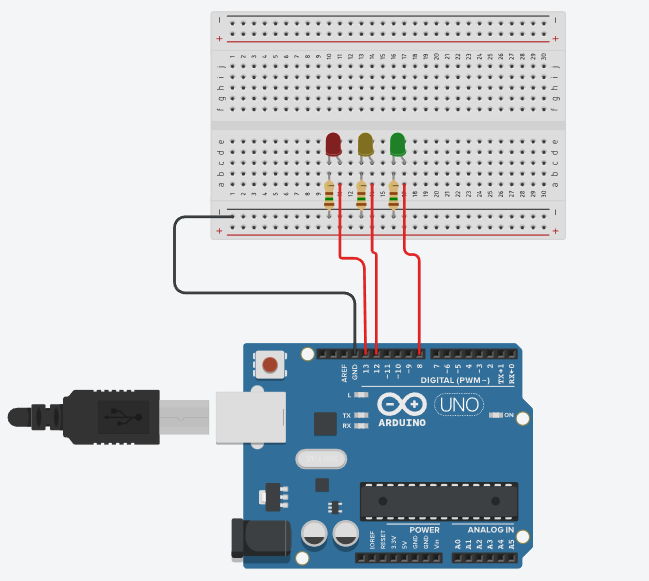
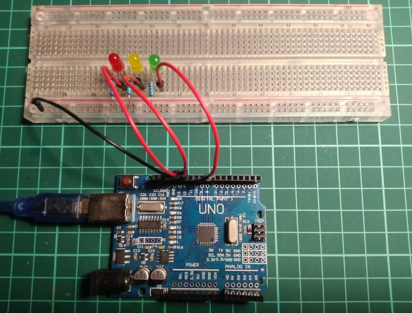

# Traffic light 

This Arduino traffic light project was created by me on a day off, purely for fun and entertainment.


## Traffic light logic

🟢 after the green light flashes, the 🟡 yellow light on, further
🔴 red lights up, red goes out, 🟡 yellow light up, 🟢 green again. 

|Signal |Before signal|Time seconds |Note     |
|:-----:|:-----------:|:-----------:|:-------:|
|🟢     |             |7            |         |
|🟢     |🟡           |1            |blink x 3|
|🟡     |🔴           |2            |         |
|🔴     |🟡           |10           |         |
|🟡     |🟢           |1            |         |


```
+---------+   +---------+   +---------+ 
|  start  |-->| R, Y, G |-->| |setup| |
+---------+   +---------+   +---------+    
                                |
                                |<--------+
                                V         |
                            *------*      |
                            | true |      |
                            *------*      ^
                                |         |
                                V         |
                            +---------+   |
                            | R.on    |   |
                            | R.light |   |
                            | R.off   |   |
                            | Y.on    |   ^
                            | Y.light |   |
                            | Y.off   |   |
                            | G.on    |   |
                            | G.light |   |
                            | G.blink |   |
                            | G.off   |   |
                            | Y.on    |   |
                            | Y.light |   |
                            | Y.off   |   |
                            +---------+   |
                                |         ^
                                V         |
                                +-------->+
```


## Materials

|Component  |Quantity|Note|
|-----------|:------:|:--:|
|Arduino Uno|1       |    |
|Red LED    |1       |    |
|Yellow LED |1       |    |
|Green LED  |1       |    |
|Resistor   |3       |150Ω|


## Prototyping




## Mounting




## Demo 


